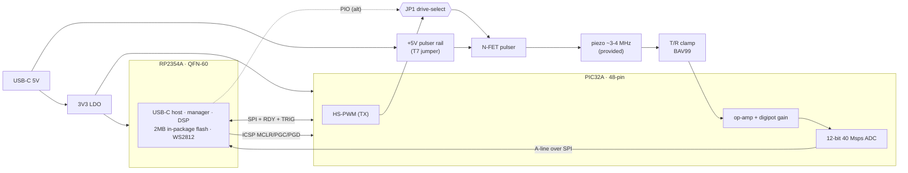
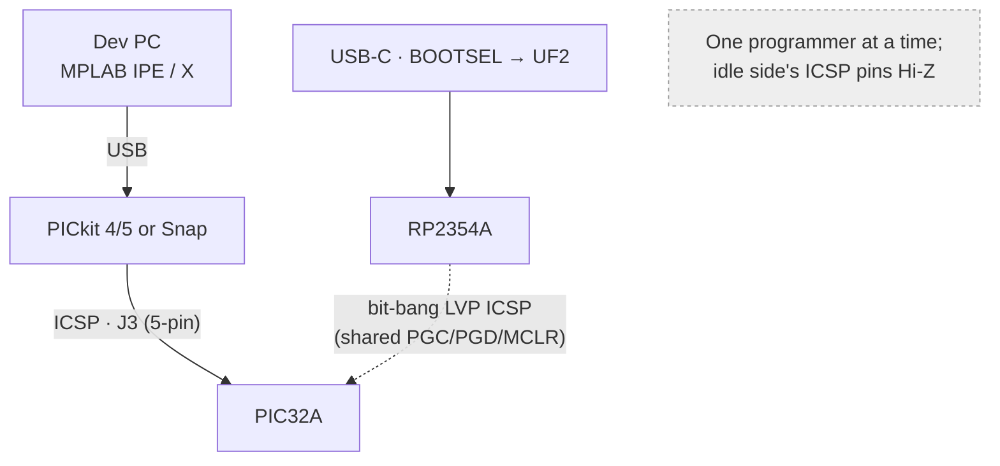

# DesignA — cheapest RP2354A + PIC32A single-channel pulse-echo badge

**Status:** concept spec (2026-09-18). No schematic yet — this is the architecture +
BOM + pulser/gain detail for the **cheapest** *minus* build. Derives from the concept
in [`../pic32/`](../pic32/README.md); obeys `requirements.md` (DP1–DP3 small/cheap/
simple, F6 per-line settable gain / no TGC, T1–T4 unipolar coded pulser).

## 1. Idea in one line

**RP2354A** (USB-C host + manager + DSP, *2 MB in-package flash → no external flash*)
paired with a **PIC32A** (on-die 40 Msps ADC + 100 MHz op-amps = the whole analog
capture chain) — two small QFNs, a single N-FET pulser off the USB 5 V rail, and a
digipot-set gain stage. Target **active-IC BOM ≈ $3.7**, whole board ≈ **$5** (ex-piezo).

## 2. Block diagram



Roles: **PIC32A owns TX + capture** (HS-PWM fires the pulser and triggers its own ADC
on-chip → no cross-chip timing); **RP2354A owns USB, control, DSP, display, and flashes
the PIC over ICSP** (one USB-C port programs both). Interconnect detail:
[`../pic32/` §3d](../pic32/README.md).

## 3. BOM (cheapest, qty ~50)

| # | Part | Role | ~$ | Source |
|---|------|------|----|--------|
| U1 | **RP2354A** (QFN-60) | MCU / USB-C / mgr / DSP; **2 MB internal flash** | **1.27** | **LCSC C41378174 / JLC ✓** (16k stk) |
| U2 | **PIC32AK3208GC41048** (48-pin) | capture engine: 40 Msps 12-bit ADC + 100 MHz op-amps | **~1.73** | Digikey ✓; **not LCSC** → consigned (N2) |
| Q1 | N-ch logic-level MOSFET (2N7002 / AO3400) | unipolar pulser switch | 0.02 | LCSC ✓ |
| D1 | BAV99 (dual diode) | T/R clamp (protect RX) | 0.02 | LCSC ✓ |
| U3 | digital pot MCP4131-10k (SPI) | per-line settable gain (feedback R) | ~0.50 | LCSC ✓ |
| U4 | 3V3 LDO (ME6211 / AP2112) | 3V3 from USB 5V | 0.10 | LCSC ✓ |
| D2 | WS2812B / SK6812 | autonomous RGB status (PIO) | 0.10 | LCSC ✓ |
| Y1 | 12 MHz crystal | RP2354 USB clock | 0.10 | LCSC ✓ |
| J1 | USB-C receptacle | host + power | 0.30 | LCSC ✓ |
| J2 | 2×1 2.54 header + uFL | transducer (F2c) | 0.30 | LCSC ✓ |
| JP1 | 3-pin header + shunt | **pulser drive-select** (PIC32 HS-PWM ⟷ RP2354 PIO, req T4a) | 0.05 | LCSC ✓ |
| J3 | 5-pin 2.54 header (or test pads) | **PIC32 ICSP** (MCLR/VDD/GND/PGD/PGC) — flash w/ PICkit (req S4a) | 0.10 | LCSC ✓ |
| — | passives (R/C, decoupling) | — | ~0.50 | LCSC ✓ |
| **Active ICs** | U1+U2+Q1+D1+U3+U4+D2 | | **≈ $3.74** | |
| **Board total** | + Y1/J1/J2/passives | (ex-piezo, provided) | **≈ $5.2** | |

**Optional (not in cheapest):** SSD1306 I²C OLED (~$1.2, F12), RP2 40-pin header
(C5, ~$0.2, can be unpopulated pads), a small gate driver (~$0.3, if pulse edges are
soft), a fixed LNA (AD8432/LMH6629, ~$5, only if SNR limits — A3a).

> **Cost vs baseline:** the RP2350+external-ADC+VGA "cheapest realistic" build is ~$33
> (options.md). DesignA is **~$5** because the ADC **and** VGA fold into the $1.7 PIC32A
> and the flash folds into the RP2354A. **Only caveat:** the PIC32A is not LCSC-stocked
> (consigned/Digikey), the one N2 hit — everything else is LCSC/JLC.

## 4. Pulser stage (unipolar, 5 V, = options.md U0)

Cheapest possible: **single N-channel logic-level MOSFET, low-side, off the USB +5 V
rail.** No boost IC, no HV.

```
        +5V (USB VBUS, via T7 jumper — swap external HV here later)
          │
        [Rd or small L]        ← damping / return
          │
   piezo ─┤ hot node ──────────┬──────────────────► to RX gain stage
          │                    │
          │                  [Rs] series           ← T/R isolation
        [Q1]  N-FET            │
    gate ─┘  drain=hot node  [D1 BAV99] clamp to 3V3/GND  ← protects PIC op-amp input
        │
      [gate driver? optional]
        │
   ┌────┴──── JP1 (3-pin drive-select jumper) ────┐
   │ centre = gate                                 │
  PIC32A HS-PWM ●   ○ ← shunt selects ○   ● RP2354 PIO
  (tight TX↔ADC sync)                    (host-side coded exc.)
       GND
```

- **Drive — jumper-selectable (req T4a):** the gate is driven by **either** the
  **PIC32A HS-PWM** (2.5 ns res, high-current I/O — tight on-chip TX↔ADC sync) **or**
  the **RP2354 PIO**, chosen by **JP1** (3-pin: gate on the centre pin, the two MCU
  sources on the ends; move the shunt to pick). **Only one drives at a time** — firmware
  sets the *un*selected pin to input/Hi-Z. Both routes support multi-cycle bursts, chirp,
  pulse-train and OOK **coded excitation** (T4). Any gate driver sits **after** JP1 so it
  serves whichever source is selected.
- **Edges:** a small logic-level FET (Ciss ~30–50 pF) switches in ~20 ns straight from
  the pin — enough for 3–4 MHz. Add a tiny gate driver only if edges are soft / for more
  amplitude.
- **Amplitude:** ~5 V — a weak but sufficient pulse for a **shallow (1–4 cm) muscle
  demo**; lean on the gain stage + averaging + coded excitation. **HV node on a header
  with a jumper (T7)** so a bigger external HV can be dropped in later.
- **T/R protection (A2):** series R + **BAV99** clamp to the 3V3/GND rails keeps the TX
  edge off the PIC op-amp input. Cheap and adequate at 5 V.

## 5. Gain stage (no TGC — per-line settable)

Per `requirements.md` F6/A3: **no TGC**; the user sets a **fixed gain, re-settable
between firing lines.** Cheapest realization uses the **PIC32A's own op-amp** with a
**digital potentiometer in the feedback path**:

```
  RX in ──[Rin]──┬──────────────┐
                 │              │
             (–) PIC32A op-amp  │        gain ≈ Rf/Rin, set by the digipot code
  ref/bias ──(+) │      ├───────┴──► op-amp out ──► PIC32A ADC (internal route)
                 │   [MCP4131]  = Rf (SPI-set)
                 └──────┘
             set over SPI by RP2354 or PIC, once per line
```

- **Why a digipot, not a DAC:** op-amp gain lives in the **resistor ratio**, so the
  right primitive is a **digitally-controlled resistor** (MCP4131 digipot / MDAC) in the
  feedback path — a DAC *voltage* only sets gain in a true VGA/multiplier. Firmware
  writes the gain code between lines (fast enough; gain is static within a line).
- **Cheaper alternative:** a **resistor bank + analog mux** (74HC4052 ~$0.15 + a few R)
  gives 3–4 discrete gain steps instead of a smooth digipot — cheapest, if a few levels
  suffice.
- **ADC:** the op-amp output feeds a **PIC32A 12-bit 40 Msps ADC** channel directly
  (on-die) — no external ADC. Capture ≤ ~150 µs @ 20 Msps (6 KB of the 8 KB SRAM),
  burst to RP2354 over SPI.
- **Noise / optional LNA:** the PIC op-amp is general-purpose; if weak-echo SNR limits
  the demo, add a fixed low-noise **LNA first stage** (A3a) — cheapest LCSC options
  **LMH6629 / ADA4898-1 / OPA847 (~$5)**. Omitted in the cheapest build.

## 6. Power & clocks

- **USB 5 V** in (J1) → pulser rail (5 V) + **3V3 LDO** (U4) for both MCUs, digipot, LED.
- RP2354 **QSPI_IOVDD must be 3.3 V** (internal flash); PIC32A runs 3.0–3.6 V — one 3V3
  rail suits both.
- RP2354 USB needs a **12 MHz crystal** (Y1); PIC32A runs off its internal FRC+PLL (no
  crystal).
- **BOOTSEL:** button from RP2354 **QSPI_CSn (SS) → GND via ~1 kΩ**, pressed at power-up
  (same as flashless RP2350A); optional **RUN reset** button to enter BOOTSEL without a
  power cycle.

## 6b. Programming / flashing (two paths)

Both MCUs must be flashable; DesignA gives **two independent routes** (req S4 / S4a):

- **RP2354A** — native **USB-C BOOTSEL → UF2** drag-and-drop (no tools). It can also act
  as the PIC programmer over the ICSP lines (§3d).
- **PIC32A** — flashed **directly over ICSP** via a **5-pin header J3** (standard
  Microchip order: **MCLR/Vpp, VDD, VSS, PGD(ICSPDAT), PGC(ICSPCLK)**) with a **PICkit
  4/5 or MPLAB Snap** — a provided `.hex` flashes with free **MPLAB IPE** (no compiler
  needed). Route **one PGECx/PGEDx pair + MCLR** to J3; keep the standard MCLR network
  (10 kΩ pull-up to VDD, no cap loading Vpp). The **same PGC/PGD/MCLR net is shared** with
  the RP2354-over-ICSP path — so either a PICkit *or* the RP2354 can program the PIC.
  Full detail: [`../pic32/pic32.md`](../pic32/pic32.md).



## Acquisition sequence (one A-line)

```mermaid
sequenceDiagram
  participant H as Host (USB)
  participant R as RP2354A
  participant P as PIC32A
  participant T as Piezo
  H->>R: configure (freq, cycles, PRF, gain, depth)
  R->>P: params + gain code (SPI)
  R->>P: TRIG (start)
  P->>T: HS-PWM burst via N-FET (coded excitation)
  T-->>P: echo → T/R clamp → op-amp+digipot → ADC
  Note over P: capture ≤150µs @20Msps into 8KB SRAM
  P-->>R: RDY (line ready)
  R->>P: read A-line (SPI burst)
  R->>R: optional DSP (bandpass/envelope/matched filter)
  R-->>H: raw/processed A-line ; RGB/OLED update
```

## 7. Open risks / to verify

- [ ] **PIC32A sourcing (N2):** not LCSC/JLC-stocked → consigned part or Digikey +
      hand-place. The one non-JLC part in DesignA. (RP2354A **is** on JLC — C41378174.)
- [ ] **PIC32A op-amp noise** vs echo level → is the optional LNA (A3a) actually needed?
- [ ] **Digipot bandwidth/parasitics** in the feedback path at 3–4 MHz (MCP4131 wiper
      capacitance) — validate, or fall back to the resistor-mux.
- [ ] **Pulse edge quality** driving the FET straight from HS-PWM (add gate driver?).
- [ ] Confirm PIC32A **48-pin** pin budget with this exact signal set (§3c/§3d) — now
      incl. JP1 drive-select (2 pins) + J3 ICSP.
- [ ] **JP1 drive-select (T4a):** firmware must set the *unselected* MCU's gate pin to
      Hi-Z/input; verify no contention and that both a PIC32 HS-PWM pin and an RP2354 PIO
      pin reach JP1.
- [ ] **Shared ICSP net:** PICkit-vs-RP2354 contention on PGC/PGD/MCLR (§6b, pic32.md) —
      RP2354 pins Hi-Z when a PICkit drives J3.
- [ ] RP2354A qty-50 LCSC price (base ~$1.27) and PIC32A qty-50 Digikey price.

## 8. Links
- Concept + trade study: [`../pic32/README.md`](../pic32/README.md) (§3a BOM, §3b gain,
  §3c chip/footprint, §3d interconnect).
- Gain/LNA IC survey + prices: [`../../systems/afe-vga-ics.md`](../../systems/afe-vga-ics.md).
- Component trade study: [`../../options.md`](../../options.md); requirements:
  [`../../requirements.md`](../../requirements.md).
