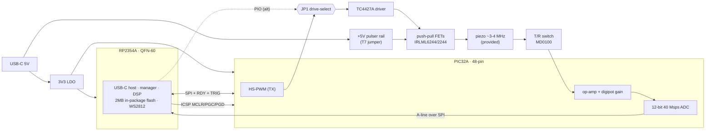
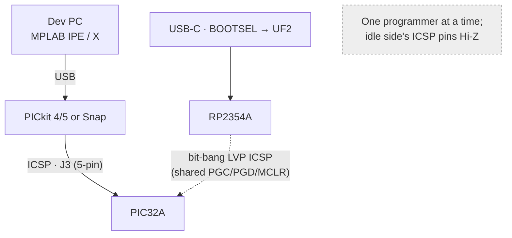

# DesignA — cheapest RP2354A + PIC32A single-channel pulse-echo badge

**Status:** concept spec (2026-09-18). No schematic yet — this is the architecture +
BOM + pulser/gain detail for the **cheapest** *minus* build. Derives from the concept
in [`../pic32/`](../pic32/README.md); obeys `requirements.md` (DP1–DP3 small/cheap/
simple, F6 per-line settable gain / no TGC, T1–T4 unipolar coded pulser).

> **Prior art / reuse (DP5):** the PIC32A analog front-end here follows the owner's own
> **[kelu124/pic32arick](https://github.com/kelu124/pic32arick)** (a PIC32AK1216GC41064
> board: 5 V pulser + op-amp chain + ADC, no RP). DesignA = **pic32arick's proven PIC32
> front-end + an RP2354A** for USB-C/manager/DSP + one-cable programming. The pulser,
> gain chain, T/R and ICSP-header choices below adopt pic32arick's validated blocks.

## 1. Idea in one line

**RP2354A** (USB-C host + manager + DSP, *2 MB in-package flash → no external flash*)
paired with a **PIC32A** (on-die 40 Msps ADC + three 100 MHz op-amps = the whole analog
gain+capture chain) — two small QFNs, a 5 V push-pull pulser (pic32arick-proven), and a
digipot-set per-line gain. Target **active-IC BOM ≈ $4.7**, whole board ≈ **$6**
(ex-piezo); an absolute-minimum single-N-FET variant ≈ $5.4.

## 2. Block diagram



Roles: **PIC32A owns TX + capture** (HS-PWM fires the pulser and triggers its own ADC
on-chip → no cross-chip timing); **RP2354A owns USB, control, DSP, display, and flashes
the PIC over ICSP** (one USB-C port programs both). Interconnect detail:
[`../pic32/` §3d](../pic32/README.md).

## 3. BOM (cheapest, qty ~50)

| # | Part | Role | ~$ | Source |
|---|------|------|----|--------|
| U1 | **RP2354A** (QFN-60) | MCU / USB-C / mgr / DSP; **2 MB internal flash** | **1.27** | **LCSC C41378174 / JLC ✓** (16k stk) |
| U2 | **PIC32AK3208GC41048** (48-pin) | capture engine: 40 Msps 12-bit ADC + 100 MHz op-amps | **~1.73** | Digikey ✓; **not LCSC** → consigned (N2) |
| Q1,Q2 | IRLML6244 (N) + IRLML2244 (P) | push-pull unipolar pulser (both edges driven) | 0.20 | LCSC ✓ |
| U5 | TC4427A dual gate driver | 3V3→5V gate drive + dead-band (SOT-23-5) | 0.30 | LCSC ✓ |
| D1 | MD0100 (T/R switch) | protect RX from TX edge (BAV99 = cheaper fallback) | ~0.60 | Digikey (BAV99 LCSC) |
| U3 | digital pot MCP4531-103 (I²C) | per-line settable gain (OA2 gain resistor) | ~0.40 | LCSC ✓ |
| U4 | 3V3 LDO (ME6211 / AP2112) | 3V3 from USB 5V | 0.10 | LCSC ✓ |
| D2 | WS2812B / SK6812 | autonomous RGB status (PIO) | 0.10 | LCSC ✓ |
| Y1 | 12 MHz crystal | RP2354 USB clock | 0.10 | LCSC ✓ |
| J1 | USB-C receptacle | host + power | 0.30 | LCSC ✓ |
| J2 | 2×1 2.54 header + uFL | transducer (F2c) | 0.30 | LCSC ✓ |
| JP1 | 3-pin header + shunt | **pulser drive-select** (PIC32 HS-PWM ⟷ RP2354 PIO, req T4a) | 0.05 | LCSC ✓ |
| J3 | 6-pin ICSP / Tag-Connect pads | **PIC32 ICSP** — flash w/ PICkit (req S4a, see pic32.md) | 0.10 | LCSC ✓ / zero-BOM |
| — | ferrite bead + passives (R/C, decoupling) | — | ~0.55 | LCSC ✓ |
| **Active ICs** | U1+U2+Q1,Q2+U5+D1+U3+U4+D2 | | **≈ $4.70** | |
| **Board total** | + Y1/J1/J2/JP1/J3/passives | (ex-piezo, provided) | **≈ $6.3** | |

**Absolute-minimum variant** (~$0.9 less): single N-FET (2N7002) instead of push-pull +
TC4427A, and BAV99 instead of MD0100 → board ≈ **$5.4**, at the cost of softer edges /
longer ring-down.

**Optional (not in cheapest):** SSD1306 I²C OLED (~$1.2, F12), RP2 40-pin header
(C5, ~$0.2, can be unpopulated pads), a fixed LNA (LMH6629/ADA4898-1, ~$5, only if SNR
limits — A3a).

> **Cost vs baseline:** the RP2350+external-ADC+VGA "cheapest realistic" build is ~$33
> (options.md). DesignA is **~$6** because the ADC **and** the whole op-amp gain chain
> fold into the $1.7 PIC32A and the flash folds into the RP2354A. **Only caveat:** the
> PIC32A is not LCSC-stocked (consigned/Digikey), the one N2 hit — everything else is
> LCSC/JLC.

## 4. Pulser stage (unipolar, 5 V, = options.md U0)

**Recommended (pic32arick-proven): push-pull complementary MOSFETs through a dual gate
driver.** Both edges are actively driven → transducer ring-down ~1–2 µs (vs RC decay),
i.e. a smaller dead zone. This is the owner's validated 5 V pulser.

```
        +5V pulser rail (USB VBUS via ferrite bead; T7 jumper for external HV)
          │
        [P-FET IRLML2244] ── pulls HIGH
          ├───────────────┬─────────────► piezo hot node ──► [MD0100 T/R] ──► RX gain
        [N-FET IRLML6244] ─┘ pulls LOW    │
          │                            [Rdamp 100–200Ω to GND]  ← ring-down damping
         GND
        gates ◄── [TC4427A dual gate driver, 3V3→5V level-shift, dead-band]
                         ▲
   ┌───────── JP1 (drive-select) ─────────┐
  PIC32A HS-PWM ●  ○── shunt ──○  ● RP2354 PIO
  (complementary PWM pair)        (PIO complementary pair)
```

- **Push-pull (recommended):** **N-FET IRLML6244** + **P-FET IRLML2244** (SOT-23),
  driven by a **TC4427A** dual gate driver (SOT-23-5, 1.5 A, level-shifts 3.3 V logic to
  the 5 V gate, built-in dead-band to avoid shoot-through). Rise ~4–5 ns; ~125 mA gate
  transient into a ~500 pF piezo. 5 V trades ~20–26 dB SNR vs a 100 V MD1213 pulser
  (< 5 cm penetration) but is cheap and HV-safe. **Active damping** option: fire a
  second, opposite pulse ~T/2 later (2nd PWM channel).
- **Absolute-minimum variant:** a **single low-side N-FET** (2N7002/AO3400) straight
  off 5 V with a **BAV99** clamp instead of the MD0100 — ~$0.5 cheaper, but softer edges
  / longer ring-down. Use only if shaving the last cents matters.
- **T/R protection (A2):** **MD0100** shunt-diode T/R switch (pic32arick) isolates the
  TX edge from the PIC op-amp input; BAV99-to-rails is the cheaper fallback.
- **Drive — jumper-selectable (req T4a):** the gate-driver **input** is fed by **either**
  the **PIC32A HS-PWM** (complementary pair, 2.5 ns res — tight on-chip TX↔ADC sync) **or**
  the **RP2354 PIO**, chosen by **JP1**. **Only one drives at a time** (the other Hi-Z).
  Both do multi-cycle bursts, chirp, pulse-train and OOK **coded excitation** (T4). The
  TC4427A sits **after** JP1, serving whichever source is selected.
- **Rail:** 5 V pulser supply isolated from logic by a **ferrite bead (~600 Ω @ 100 MHz)**
  + local decoupling; **HV node on the T7 jumper** so external HV can replace it later.
- **Amplitude:** ~5 V — enough for a **shallow (1–4 cm) muscle demo**; lean on the gain
  stage + averaging + coded excitation.

## 5. Gain stage (no TGC — per-line settable)

Per `requirements.md` F6/A3: **no TGC**; the user sets a **fixed gain, re-settable
between firing lines.** Adopts the **pic32arick 3-op-amp chain** — all three op-amps are
**on-die in the PIC32A** (zero extra amplifier ICs); only the digipot is external:

```
 RX ─[MD0100]─► OA1 fixed  ──► OA2 variable ──► [2-pole RC AAF] ──► PIC32A ADC (12b/40Msps)
                +14.5 dB        6–42 dB            (100Ω+56pF)×2       (internal route)
                (Rf1 4.3k/       gain set by
                 Rg1 1k)         MCP4531-103 digipot (I²C)
                                       ▲
       OA3 = mid-rail bias buffer      └── wiper code set per line by RP2354/PIC (I²C)
```

- **OA1 — fixed first stage** (non-inverting, 1+4.3k/1k ≈ **5.3× / +14.5 dB**, Cf 2.2 pF):
  gain kept constant so the **noise figure** is set once (best sensitivity).
- **OA2 — variable stage:** non-inverting, gain resistor = **MCP4531-103** digital pot
  (I²C, 10 kΩ/128 steps) → **~2–129× (6–42 dB)**; Rf2 10 k, Cf2 1.5 pF. Firmware writes
  the wiper code **once per line** (no TGC).
- **OA3 — mid-rail bias** unity-gain buffer (single-supply biasing).
- **Combined:** ~**+20.5 dB … +56.5 dB**, then a **2-pole RC anti-alias** ((100 Ω+56 pF)×2,
  ~−3.7 dB at 20 MHz Nyquist) into a **PIC32A 12-bit 40 Msps ADC** channel (on-die — no
  external ADC).
- **Why a digipot, not a DAC:** gain lives in the **resistor ratio**; the digipot *is*
  the gain resistor. (A DAC voltage only sets gain in a true VGA/multiplier.)

- **Why a digipot, not a DAC:** op-amp gain lives in the **resistor ratio**, so the
  right primitive is a **digitally-controlled resistor** (MCP4131 digipot / MDAC) in the
  feedback path — a DAC *voltage* only sets gain in a true VGA/multiplier. Firmware
  writes the gain code between lines (fast enough; gain is static within a line).
- **Capture:** ≤ ~150 µs @ 20 Msps (6 KB of the PIC's 8 KB SRAM); PIC bursts the A-line
  to RP2354 over SPI.
- **Cheaper alternative:** a resistor bank + analog mux (74HC4052) gives 3–4 discrete
  gain steps instead of the digipot — if a few levels suffice.
- **Optional LNA (A3a):** the PIC op-amps are general-purpose; if weak-echo SNR limits
  the demo, add a fixed low-noise LNA first stage (LMH6629/ADA4898-1/OPA847 ~$5). Omitted
  in the cheapest build.

## 6. Power & clocks

- **USB 5 V** in (J1) → pulser rail (5 V) + **3V3 LDO** (U4) for both MCUs, digipot, LED.
- RP2354 **QSPI_IOVDD must be 3.3 V** (internal flash); PIC32A runs 3.0–3.6 V — one 3V3
  rail suits both.
- RP2354 USB needs a **12 MHz crystal** (Y1); PIC32A runs off its internal FRC+PLL (no
  crystal).
- **BOOTSEL:** button from RP2354 **QSPI_CSn (SS) → GND via ~1 kΩ**, pressed at power-up
  (same as flashless RP2350A); optional **RUN reset** button to enter BOOTSEL without a
  power cycle.

## 6b. Programming / flashing (two paths)

Both MCUs must be flashable; DesignA gives **two independent routes** (req S4 / S4a):

- **RP2354A** — native **USB-C BOOTSEL → UF2** drag-and-drop (no tools). It can also act
  as the PIC programmer over the ICSP lines (§3d).
- **PIC32A** — flashed **directly over ICSP** via a **5-pin header J3** (standard
  Microchip order: **MCLR/Vpp, VDD, VSS, PGD(ICSPDAT), PGC(ICSPCLK)**) with a **PICkit
  4/5 or MPLAB Snap** — a provided `.hex` flashes with free **MPLAB IPE** (no compiler
  needed). Route **one PGECx/PGEDx pair + MCLR** to J3; keep the standard MCLR network
  (10 kΩ pull-up to VDD, no cap loading Vpp). The **same PGC/PGD/MCLR net is shared** with
  the RP2354-over-ICSP path — so either a PICkit *or* the RP2354 can program the PIC.
  Full detail: [`../pic32/pic32.md`](../pic32/pic32.md).



## Acquisition sequence (one A-line)

```mermaid
sequenceDiagram
  participant H as Host (USB)
  participant R as RP2354A
  participant P as PIC32A
  participant T as Piezo
  H->>R: configure (freq, cycles, PRF, gain, depth)
  R->>P: params + gain code (SPI)
  R->>P: TRIG (start)
  P->>T: HS-PWM burst via N-FET (coded excitation)
  T-->>P: echo → T/R clamp → op-amp+digipot → ADC
  Note over P: capture ≤150µs @20Msps into 8KB SRAM
  P-->>R: RDY (line ready)
  R->>P: read A-line (SPI burst)
  R->>R: optional DSP (bandpass/envelope/matched filter)
  R-->>H: raw/processed A-line ; RGB/OLED update
```

## 7. Open risks / to verify

- [ ] **PIC32A sourcing (N2):** not LCSC/JLC-stocked → consigned part or Digikey +
      hand-place. The one non-JLC part in DesignA. (RP2354A **is** on JLC — C41378174.)
- [ ] **PIC32A op-amp noise** vs echo level → is the optional LNA (A3a) actually needed?
- [ ] **Digipot bandwidth/parasitics** on OA2 (MCP4531 wiper capacitance) at 3–4 MHz —
      validate, or fall back to the resistor-mux.
- [ ] **MD0100 vs BAV99** T/R (cost vs protection); **complementary-PWM dead-band** on
      the TC4427A (shoot-through) — reuse pic32arick's proven values.
- [ ] Confirm PIC32A **48-pin** pin budget with this exact signal set (§3c/§3d) — now
      incl. JP1 drive-select (2 pins) + J3 ICSP.
- [ ] **JP1 drive-select (T4a):** firmware must set the *unselected* MCU's gate pin to
      Hi-Z/input; verify no contention and that both a PIC32 HS-PWM pin and an RP2354 PIO
      pin reach JP1.
- [ ] **Shared ICSP net:** PICkit-vs-RP2354 contention on PGC/PGD/MCLR (§6b, pic32.md) —
      RP2354 pins Hi-Z when a PICkit drives J3.
- [ ] RP2354A qty-50 LCSC price (base ~$1.27) and PIC32A qty-50 Digikey price.

## 8. Links
- **Prior art (owner's PIC32A board):** [kelu124/pic32arick](https://github.com/kelu124/pic32arick)
  — pulser, op-amp chain, programming header this design reuses.
- **Toolchain (Ubuntu CLI + Makefile):** [`toolchain_designA.md`](toolchain_designA.md).
- **PIC32 flashing / ICSP header:** [`../pic32/pic32.md`](../pic32/pic32.md).
- Concept + trade study: [`../pic32/README.md`](../pic32/README.md) (§3a BOM, §3b gain,
  §3c chip/footprint, §3d interconnect).
- Gain/LNA IC survey + prices: [`../../systems/afe-vga-ics.md`](../../systems/afe-vga-ics.md).
- Component trade study: [`../../options.md`](../../options.md); requirements:
  [`../../requirements.md`](../../requirements.md).
