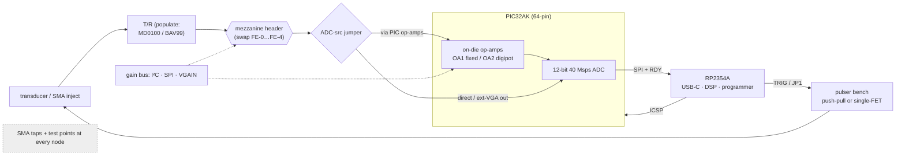

# DesignA-DK — RP2354A + PIC32AK development kit (derisking board)

**Status:** concept spec (2026-09-21). The **eval/derisk** sibling of
[DesignA](../designA/README.md): same silicon (RP2354A + PIC32AK), but **large, fully
broken-out, and modular** so every contested front-end / pulser / gain decision can be
**swapped and measured** on the bench before the cheap DesignA badge is frozen.

## 1. Philosophy — measure, don't guess

Space and BOM are *not* constraints here. So every design choice that is currently an
open question becomes either a **swappable daughter-card**, a **populate-option**, or a
**jumper**, and every analog node gets a **test point / SMA tap**. The devkit's job is to
turn the open items in [`../designA`](../designA/README.md) §7 and
[`../pic32`](../pic32/README.md) §5 into **bench measurements**.

## 2. What we're derisking (map)

| Open decision | How the devkit answers it |
|---------------|---------------------------|
| PIC32A ADC real perf (ENOB, gap-free 40/20 Msps, SRAM depth) | SMA inject a known tone/pulse at the ADC node; capture; measure. Also derisk on vendor eval HW (§9). |
| Do we need an external **LNA**, or are the PIC op-amps enough? | Swap RX front-end cards FE-0…FE-4 (§4); compare SNR on the same target. |
| **Gain-control** method (digipot I²C vs SPI vs resistor-mux vs VGA Vgain) | Populate-options + a common gain bus (§5); compare BW/steps/noise. |
| **Pulser**: push-pull vs single-FET; 5 V enough?; ring-down | Pulser bench with both fitted + HV-rail select + damping options (§6). |
| **TX drive source** (PIC HS-PWM vs RP2354 PIO) | JP1 drive-select (as DesignA) — try both. |
| **T/R**: MD0100 vs BAV99 vs none | Populate-option on each FE card / mainboard. |
| Inter-MCU **SPI/RDY/TRIG** + **ICSP-from-RP2354** | All lines on headers + test points; both programming paths. |
| **Pin budget** | Use the 64-pin PIC (no budget worries); down-spec later. |

## 3. Core spine (fixed)

- **RP2354A** (QFN-60) — USB-C, manager, DSP, WS2812, ICSP programmer. 2 MB internal flash.
- **PIC32AK6416GC41064** (64-pin) — **64 KB flash / 16 KB RAM** (enough for 150 µs @ full
  40 Msps) and **max pins/analog inputs** so nothing is pin-limited during eval. (DesignA
  down-specs to the 48-pin `3208` once decisions lock.)
- **USB-C** (host+power) + optional **barrel/bench-supply** input via jumper.
- **Power: split, jumpered rails** — separate **AVDD (analog 3V3)** and **DVDD (digital
  3V3)** each behind a 0 Ω / ferrite + a current-sense pad, so analog noise contributions
  are measurable. Pulser 5 V rail isolated by a ferrite (as pic32arick).
- **Programming:** both paths — a **6-pin ICSP header (+ Tag-Connect pads)** for a PICkit,
  *and* the RP2354-over-ICSP net. RP2354 BOOTSEL + RUN buttons.
- **Everything broken out:** all PIC32 GPIO/analog/op-amp/HS-PWM pins and RP2354
  GPIO/PIO to **labelled 0.1″ headers** (classic dev-board fan-out).

## 4. Modular RX front-end (the key derisk)

A **standard mezzanine header** carries the RX path so daughter-cards swap in seconds.
The mainboard has jumpers to choose the **ADC-input source** = { PIC op-amp out /
mezzanine out / direct }, and to route the PIC op-amp pins (OA1/OA2 in/out) to the header.

**Mezzanine bus (one 2×… header):** `TRANSDUCER_IN, GND, +5V, +3V3(AVDD), ADC_OUT,
I²C(SDA/SCL), SPI(optional), VGAIN(analog), TXGATE, TRIG, 2× spare`.

Front-end cards (same connector, compare on the same phantom/target):

| Card | Path | Tests |
|------|------|-------|
| **FE-0 straight** | transducer → T/R → ADC (no gain) | baseline noise floor / dynamic range |
| **FE-A PIC-opamp** | T/R → PIC OA1(fixed) → OA2(digipot) → ADC | the DesignA path |
| **FE-B LNA + PIC-opamp** | T/R → **LNA (AD8432 / LMH6629 / OPA847)** → PIC OA → ADC | does an LNA lift SNR? |
| **FE-C ext VGA** | T/R → **AD8331** (LNA+VGA) → ADC (bypass PIC opamps) | proven ultrasound VGA reference |
| **FE-D ext VGA LP** | T/R → **AD8338** → ADC | low-power/cheaper VGA |

> This is exactly "different front ends on top of the PIC32 op-amps": FE-B pre-conditions
> *before* the PIC op-amps; FE-C/D *bypass* them; FE-0 skips gain entirely — all measured
> against FE-A.

## 5. Gain-control options (populate + jumper)

On the FE-A card and mainboard, make the gain-set element selectable so we can compare:
- **MCP4531-103** digipot (**I²C**) — DesignA default.
- **MCP4131** digipot (**SPI**) — compare bandwidth/wiper parasitics.
- **Resistor bank + 74HC4052** analog mux — stepped gain, cheapest.
- **VGA Vgain** drive for FE-C/D: from a small **DAC (MCP4728)** *or* **RP2354 PWM+RC** —
  compare a real control-voltage VGA vs the digipot approach.

Pick via a jumper block; bring `VGAIN`, `SDA/SCL`, `SPI` to the mezzanine so any card can
use any method.

## 6. Pulser bench (populate-options)

- **Push-pull** IRLML6244/2244 + **TC4427A** (pic32arick default) **and** pads for a
  **single low-side N-FET** — fit either, compare edges/ring-down.
- **HV-rail select jumper:** USB **5 V** / on-board **boost** (footprint) / **external HV**
  (T7 header) — quantify amplitude vs depth. Pads for an **MD1213/TC6320** HV pulser too.
- **Damping** options: selectable series/parallel R (100–200 Ω) + the active-damping 2nd
  pulse.
- **TX drive** via **JP1** (PIC32 HS-PWM ⟷ RP2354 PIO), gate driver after the jumper.
- **T/R** populate-option: MD0100 / BAV99.

## 7. Measurement & self-test aids

- **SMA/coax taps** at: transducer node, LNA out, VGA/op-amp out, **ADC input**, TX gate.
  → inject from a signal generator / probe with a scope to characterise **gain, −3 dB BW,
  noise, linearity, ADC ENOB** of each block *independently* (no acoustics needed).
- **Loopback self-test mux** (pic32arick): switch the RX input between the transducer and
  an **internal DAC / injected reference**, so the chain can be characterised electrically.
- **Test points** on all rails, clocks (RP2354 12 MHz xtal, PIC PLL), SPI/I²C, RDY, TRIG,
  MCLR/PGC/PGD, HV rail.
- Generous **silkscreen** labelling every block, header pin, and jumper (M5).

## 8. Fabrication

- **4-layer** (clean analog ground/return; the ADC/op-amp noise story depends on it),
  size unconstrained. JLC-assemble the fine-pitch parts (RP2354, PIC32AK); hand-solder
  headers/jumpers/SMA. Fits the same LCSC/JLC flow as DesignA (PIC32A still the one
  consigned part — N2).

## 9. Parallel derisking with vendor eval hardware (do this first / cheapest)

Before (and alongside) the custom devkit, derisk the **highest-risk, silicon-level**
questions on off-the-shelf boards — this validates firmware + toolchain with zero PCB
spin:
- **PIC32A:** Microchip **Curiosity Platform (EV74H48A) + the PIC32AK GP-DIM**
  ([`pic32ak1216gc41064-gpdim-demo`](https://github.com/microchip-pic-avr-examples/pic32ak1216gc41064-gpdim-demo))
  → prove **ADC gap-free capture, op-amp gain, HS-PWM pulser timing**, and the **Linux
  XC-DSC + ipecmd** toolchain (resolves the "verify" items in `toolchain_designA.md`).
- **RP2354A:** a **Pico 2 / bare RP2354 module** → prove USB, PIO pulse/coded excitation,
  SPI ingest of a PIC A-line, DSP, WS2812.
- Then the devkit integrates the two and exercises the **analog** trade-offs (§4–§6) that
  the eval boards can't.

## 10. Path back to DesignA

Once the bench picks winners (LNA yes/no, which gain method, push-pull vs single, HV
level, 48- vs 64-pin, SRAM tier), **down-spec** to the cheap DesignA: one FE, one gain
method, minimal pulser, 48-pin `3208`, small board. The devkit's schematic blocks are
the library DesignA draws from.

## Links
- Target product: [`../designA/README.md`](../designA/README.md) · concept/trade study:
  [`../pic32/README.md`](../pic32/README.md) · PIC32 flashing: [`../pic32/pic32.md`](../pic32/pic32.md).
- Toolchain: [`../designA/toolchain_designA.md`](../designA/toolchain_designA.md).
- Gain/LNA IC survey + prices: [`../../systems/afe-vga-ics.md`](../../systems/afe-vga-ics.md).
- Prior art: [kelu124/pic32arick](https://github.com/kelu124/pic32arick).
