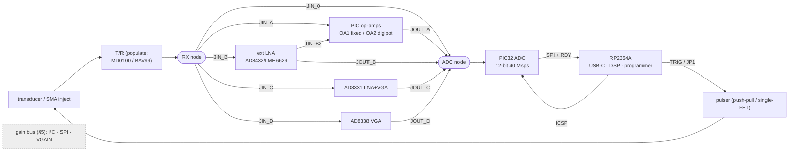

# DesignA-DK — RP2354A + PIC32AK development kit (derisking board)

**Status:** concept spec (2026-09-21). The **eval/derisk** sibling of
[DesignA](../designA/README.md): same silicon (RP2354A + PIC32AK), but **large, fully
broken-out, and modular** so every contested front-end / pulser / gain decision can be
**swapped and measured** on the bench before the cheap DesignA badge is frozen.

## 1. Philosophy — measure, don't guess

Space and BOM are *not* constraints here. So every design choice that is currently an
open question becomes either an **on-board block behind a jumper**, a **populate-option**,
or a **routing jumper** — one board, no daughter-cards — and every analog node gets a
**test point / SMA tap**. The devkit's job is to
turn the open items in [`../designA`](../designA/README.md) §7 and
[`../pic32`](../pic32/README.md) §5 into **bench measurements**.

## 2. What we're derisking (map)

| Open decision | How the devkit answers it |
|---------------|---------------------------|
| PIC32A ADC real perf (ENOB, gap-free 40/20 Msps, SRAM depth) | SMA inject a known tone/pulse at the ADC node; capture; measure. Also derisk on vendor eval HW (§9). |
| Do we need an external **LNA**, or are the PIC op-amps enough? | Jumper-select FE-0…FE-D (§4); compare SNR on the same target. |
| **ADC input conditioning** (mid-rail bias, ~2.8 Vpp fit, clip onset, ENOB near rails, AC-coupling corner) | Bias-point test point; SMA inject a known ±V swing; sweep gain to clip; measure ENOB vs level (DesignA §5a). |
| **TX↔ADC hardware trigger** (PWM-generated trigger jitter/delay) | Scope TX first edge vs ADC-start on a test point; measure jitter/pre-delay; compare PIC-HS-PWM vs RP2354-via-TRIG (DesignA §5b). |
| **Gain-control** method (digipot I²C vs SPI vs resistor-mux vs VGA Vgain) | Populate-options + a common gain bus (§5); compare BW/steps/noise. |
| **Pulser**: push-pull vs single-FET; 5 V enough?; ring-down | Pulser bench with both fitted + HV-rail select + damping options (§6). |
| **TX drive source** (PIC HS-PWM vs RP2354 PIO) | JP1 drive-select (as DesignA) — try both. |
| **T/R**: MD0100 vs BAV99 vs none | Populate-option on each FE card / mainboard. |
| Inter-MCU **SPI/RDY/TRIG** + **ICSP-from-RP2354** | All lines on headers + test points; both programming paths. |
| **Pin budget** | Use the 64-pin PIC (no budget worries); down-spec later. |

## 3. Core spine (fixed)

- **RP2354A** (QFN-60) — USB-C, manager, DSP, WS2812, ICSP programmer. 2 MB internal flash.
- **PIC32AK6416GC41064** (64-pin) — **64 KB flash / 16 KB RAM** (enough for 150 µs @ full
  40 Msps) and **max pins/analog inputs** so nothing is pin-limited during eval. (DesignA
  down-specs to the 48-pin `3208` once decisions lock.)
- **USB-C** (host+power) + optional **barrel/bench-supply** input via jumper.
- **Power: split, jumpered rails** — separate **AVDD (analog 3V3)** and **DVDD (digital
  3V3)** each behind a 0 Ω / ferrite + a current-sense pad, so analog noise contributions
  are measurable. Pulser 5 V rail isolated by a ferrite (as pic32arick).
- **Programming:** both paths — a **6-pin ICSP header (+ Tag-Connect pads)** for a PICkit,
  *and* the RP2354-over-ICSP net. RP2354 BOOTSEL + RUN buttons.
- **Everything broken out:** all PIC32 GPIO/analog/op-amp/HS-PWM pins and RP2354
  GPIO/PIO to **labelled 0.1″ headers** (classic dev-board fan-out).

## 4. On-board RX front-ends, jumper-selected (the key derisk)

**No mezzanine / daughter-cards.** All front-end blocks live on the **one board**,
populated in parallel; a pair of jumpers routes exactly **one path** at a time from a
common **RX node** (after the T/R) to a common **ADC node** (the PIC32 ADC input).

**Routing scheme** — each block taps the RX node through its own **input jumper**
(`JIN_*`) and drives the ADC node through its own **output jumper** (`JOUT_*`). Fit one
`JIN`+`JOUT` shunt pair to select a path; the unused blocks are left un-jumpered (isolated,
no loading). FE-0 is a single RX→ADC link.

Selectable paths (all on the one board; pick with the `JIN`/`JOUT` shunts):

| Path | JIN / JOUT | Route | Tests |
|------|-----------|-------|-------|
| **FE-0 straight** | JIN_0 | RX → ADC (no gain) | baseline noise floor / dynamic range |
| **FE-A PIC-opamp** | JIN_A / JOUT_A | RX → PIC OA1(fixed) → OA2(digipot) → ADC | the DesignA path |
| **FE-B LNA + PIC-opamp** | JIN_B / JIN_B2 / JOUT_A | RX → **LNA** → PIC OA → ADC | does an LNA lift SNR? |
| **FE-C ext VGA** | JIN_C / JOUT_C | RX → **AD8331** → ADC (bypass PIC opamps) | proven ultrasound VGA reference |
| **FE-D ext VGA LP** | JIN_D / JOUT_D | RX → **AD8338** → ADC | low-power/cheaper VGA |

> This is "different front ends on top of the PIC32 op-amps" without connectors: FE-B feeds
> the PIC op-amps through an external LNA; FE-C/D bypass them; FE-0 skips gain — each is a
> jumper choice, measured against FE-A on the same target. Keep the parallel input taps
> **short** and place `JIN` links right at the RX node to minimise stubs on the RF path.

## 5. Gain-control options (populate + jumper)

The gain-set element for the PIC-op-amp path (FE-A) is a **jumper-selected** choice among
several on-board options, so we can compare:
- **MCP4531-103** digipot (**I²C**) — DesignA default.
- **MCP4131** digipot (**SPI**) — compare bandwidth/wiper parasitics.
- **Resistor bank + 74HC4052** analog mux — stepped gain, cheapest.
- **VGA Vgain** drive for FE-C/D: from a small **DAC (MCP4728)** *or* **RP2354 PWM+RC** —
  compare a real control-voltage VGA vs the digipot approach.

A **jumper block** selects which device sits in the OA2 gain node / drives the VGA `VGAIN`
pin; the I²C, SPI and `VGAIN` nets run to all candidates on the one board.

## 6. Pulser bench (populate-options)

- **Push-pull** IRLML6244/2244 + **TC4427A** (pic32arick default) **and** pads for a
  **single low-side N-FET** — fit either, compare edges/ring-down.
- **HV-rail select jumper:** USB **5 V** / on-board **boost** (footprint) / **external HV**
  (T7 header) — quantify amplitude vs depth. Pads for an **MD1213/TC6320** HV pulser too.
- **Damping** options: selectable series/parallel R (100–200 Ω) + the active-damping 2nd
  pulse.
- **TX drive** via **JP1** (PIC32 HS-PWM ⟷ RP2354 PIO), gate driver after the jumper.
- **T/R** populate-option: MD0100 / BAV99.

## 7. Measurement & self-test aids

- **SMA/coax taps** at: transducer node, LNA out, VGA/op-amp out, **ADC input**, TX gate.
  → inject from a signal generator / probe with a scope to characterise **gain, −3 dB BW,
  noise, linearity, ADC ENOB** of each block *independently* (no acoustics needed).
- **Loopback self-test mux** (pic32arick): switch the RX input between the transducer and
  an **internal DAC / injected reference**, so the chain can be characterised electrically.
- **Test points** on all rails, clocks (RP2354 12 MHz xtal, PIC PLL), SPI/I²C, RDY, TRIG,
  MCLR/PGC/PGD, HV rail.
- Generous **silkscreen** labelling every block, header pin, and jumper (M5).

## 8. Fabrication

- **4-layer** (clean analog ground/return; the ADC/op-amp noise story depends on it),
  size unconstrained. JLC-assemble the fine-pitch parts (RP2354, PIC32AK); hand-solder
  headers/jumpers/SMA. Fits the same LCSC/JLC flow as DesignA (PIC32A still the one
  consigned part — N2).

## 9. Parallel derisking with vendor eval hardware (do this first / cheapest)

Before (and alongside) the custom devkit, derisk the **highest-risk, silicon-level**
questions on off-the-shelf boards — this validates firmware + toolchain with zero PCB
spin:
- **PIC32A:** Microchip **Curiosity Platform (EV74H48A) + the PIC32AK GP-DIM**
  ([`pic32ak1216gc41064-gpdim-demo`](https://github.com/microchip-pic-avr-examples/pic32ak1216gc41064-gpdim-demo))
  → prove **ADC gap-free capture, op-amp gain, HS-PWM pulser timing**, and the **Linux
  XC-DSC + ipecmd** toolchain (resolves the "verify" items in `toolchain_designA.md`).
- **RP2354A:** a **Pico 2 / bare RP2354 module** → prove USB, PIO pulse/coded excitation,
  SPI ingest of a PIC A-line, DSP, WS2812.
- Then the devkit integrates the two and exercises the **analog** trade-offs (§4–§6) that
  the eval boards can't.

## 10. Path back to DesignA

Once the bench picks winners (LNA yes/no, which gain method, push-pull vs single, HV
level, 48- vs 64-pin, SRAM tier), **DesignA is the devkit with the losing blocks removed**
— keep the winning FE path (drop the other `JIN`/`JOUT` links and their parts), one gain
method, minimal pulser, 48-pin `3208`, small board. Because it's one board with jumpers
(not daughter-cards), down-spec = **depopulate + hard-wire the chosen jumpers**; the
schematic blocks carry straight over.

## Links
- Target product: [`../designA/README.md`](../designA/README.md) · concept/trade study:
  [`../pic32/README.md`](../pic32/README.md) · PIC32 flashing: [`../pic32/pic32.md`](../pic32/pic32.md).
- Toolchain: [`../designA/toolchain_designA.md`](../designA/toolchain_designA.md).
- Gain/LNA IC survey + prices: [`../../systems/afe-vga-ics.md`](../../systems/afe-vga-ics.md).
- Prior art: [kelu124/pic32arick](https://github.com/kelu124/pic32arick).

---

# PCB designer brief (shareable)

> **Standalone one-file version for handoff:** [`pcb-brief.md`](pcb-brief.md) — the same
> brief without the surrounding derisk-planning context. Keep the two in sync.

> Self-contained summary for a PCB designer. This board is an **evaluation / derisking
> platform** — the goal is **flexibility and measurability, not size or cost**. Everything
> is on **one board**; contested choices are selected with **jumpers** and every analog
> node has a **test point / SMA tap**.

## B1. What this board is

A single-channel **pulse-echo ultrasound** front-end dev board pairing two MCUs:
- **RP2354A** (Raspberry Pi, QFN-60, 7×7 mm) — USB-C host link, system manager, DSP,
  RGB LED, and **in-system programmer for the PIC** over ICSP. 2 MB in-package flash
  (no external flash chip). LCSC/JLC `C41378174`.
- **PIC32AK6416GC41064** (Microchip, 64-pin TQFP or VQFN) — the **analog capture engine**:
  three on-die 100 MHz op-amps (RX gain), a 12-bit 40 Msps ADC, HS-PWM (pulser + ADC
  trigger). Runs 3.0–3.6 V. *(Sourcing note: not currently LCSC-stocked — consign or
  hand-place; full datasheet DS70005592 in `pdfs/datasheets/`.)*

Signal flow: **transducer → T/R → [selectable RX front-end] → PIC32 ADC → SPI → RP2354 →
USB-C**; **RP2354/PIC HS-PWM → pulser → transducer**.

## B2. Board-level requirements

- **4-layer**, solid ground plane under the analog section; **size unconstrained**
  (favour clean layout + probe access over compactness).
- **All MCU pins broken out** to labelled 0.1″ headers (classic dev-board fan-out).
- **KiCad** source deliverable (schematic, PCB, gerbers, BOM CSV); fine-pitch parts
  (RP2354A, PIC32AK) placed for JLCPCB assembly, headers/jumpers/SMA hand-solderable.
- **Self-documenting silkscreen:** label every functional block, header pin, jumper, and
  test point.

## B3. Power & clocks

| Rail | Source | Notes |
|------|--------|-------|
| +5 V | USB-C VBUS | logic-side 5 V; also the **pulser rail** but **ferrite-isolated** (≈600 Ω @100 MHz) with local bulk+HF decoupling near the FETs |
| +3V3 DVDD | 3V3 LDO from 5 V | digital: RP2354, PIC digital, LED, logic |
| +3V3 AVDD | from 3V3 (ferrite/0 Ω link + **current-sense pads**) | analog: PIC AVDD, op-amp/ADC; keep quiet |
| VREF | AVDD (default) or ext VREF+ pin | ADC full-scale; decouple per datasheet |

- **RP2354 QSPI_IOVDD must be 3.3 V** (internal flash). PIC needs its **VCAP** cap.
- **RP2354 USB clock:** 12 MHz crystal close to the device. **PIC** runs on internal
  FRC+PLL (no crystal). Per-pin 100 nF decoupling on every supply pin.

## B4. Programming / debug (two paths, shared net)

- **RP2354:** USB-C **BOOTSEL** button (wire **QSPI_CSn/SS → GND via ~1 kΩ**, pressed at
  power-up) + a **RUN** reset button. Flash via UF2.
- **PIC32:** **6-pin ICSP** header `1 MCLR/Vpp · 2 VDD · 3 GND · 4 PGED1 · 5 PGEC1 · 6 NC`
  **plus Tag-Connect TC2030-NL pads** (and consider the **off-center/alternated friction-
  fit holes** for solderless press-fit). **47 Ω series** on PGEC1/PGED1; **10 kΩ** MCLR
  pull-up, short MCLR net, no cap loading Vpp.
- The **RP2354 also connects to PGC/PGD/MCLR** so it can bit-bang LVP ICSP (one USB-C port
  programs both). Only one programmer active at a time → keep RP2354 pins Hi-Z when a
  PICkit drives the header (series R / firmware).

## B5. Inter-MCU interface (RP2354 ↔ PIC32)

| Bus | Signals | Purpose |
|-----|---------|---------|
| SPI | SCK, MOSI, MISO, CS | RP2354 master reads the captured A-line from the PIC (≤40 Mbps) |
| IRQ | RDY | PIC → RP2354 "line ready" |
| Trigger | TRIG | RP2354 → PIC ADC ext-trigger (used when RP2354 owns TX) |
| I²C | SDA, SCL | gain-control digipot/DAC + OLED |
| UART | TX, RX | debug/log (optional) |

## B6. Transmit / pulser (bench, populate-options)

- **Push-pull** default: **IRLML6244 (N)** + **IRLML2244 (P)** driven by a **TC4427A**
  dual gate driver (3V3→5V level-shift, dead-band). **Footprint for a single low-side
  N-FET (2N7002)** as the minimal alternative.
- **Gate-drive source = JP1** (3-pin): **PIC32 HS-PWM** ⟷ **RP2354 PIO**; the TC4427A sits
  after JP1. Only one source at a time (other Hi-Z).
- **HV-rail select jumper:** USB **5 V** / on-board **boost** (footprint) / **external HV**
  header (T7). Also **pads for an MD1213 + TC6320** high-voltage pulser for later.
- **Damping:** selectable series/parallel resistor (100–200 Ω) at the transducer node.
- **T/R protection:** **MD0100** (footprint) with a **BAV99** clamp alternative.
- **TX↔ADC coupling:** the PIC HS-PWM that drives the gate can also emit the ADC start
  trigger (same counter) — route so this is exercisable; expose the trigger on a TP.

## B7. Receive front-end (jumper-selected, all on-board)

Common **RX node** (after T/R) and common **ADC node** (to a PIC ADC input). Each block
taps RX via `JIN_*` and drives the ADC node via `JOUT_*`; fit one JIN+JOUT pair to select
a path (unused blocks left un-jumpered → isolated). **Keep JIN links right at the RX node
to minimise stubs.**

| Path | Blocks to place | Route |
|------|-----------------|-------|
| FE-0 straight | (link only) | RX → ADC |
| FE-A PIC-opamp | route PIC OA1/OA2/OA3 in/out pins to the board | RX → OA1 fixed → OA2 (digipot) → ADC |
| FE-B LNA + PIC-opamp | **AD8432 / LMH6629 / OPA847** | RX → LNA → PIC OA → ADC |
| FE-C ext VGA | **AD8331** (QSOP-20) | RX → AD8331 → ADC |
| FE-D ext VGA (LP) | **AD8338** (LFCSP-16 3×3) | RX → AD8338 → ADC |

- **Gain-control options** (jumper-selected into the OA2 gain node / VGA Vgain):
  **MCP4531** digipot (I²C) · **MCP4131** digipot (SPI) · **74HC4052** resistor-mux ·
  **MCP4728** DAC or RP2354 **PWM+RC** for VGA Vgain.
- **ADC input conditioning (critical — single supply):** the front-end must present a
  signal **AC-coupled and biased to mid-rail VREF/2 ≈ 1.65 V**, scaled so the largest echo
  ≈ **2.6–2.8 Vpp** (never bipolar; ADC is 0→VREF). Provide the **mid-rail bias buffer**
  (PIC OA3 or a divider+buffer) and an **overrange clamp** (diodes to the rails) at the
  ADC input. Anti-alias: 2-pole RC (≈ (100 Ω+56 pF)×2) before the ADC.

## B8. Transducer & I/O connectors

- Transducer: **SMA/coax + 2×1 2.54 mm header + u.FL** (all three footprints; populate
  as needed).
- **SMA/coax taps** at: transducer node, LNA out, VGA/op-amp out, **ADC input**, TX gate —
  for signal-generator injection / scope probing (high-Z nodes: AC-couple / series-R the
  tap so it doesn't load the path).
- **Loopback self-test:** a mux/jumper to switch the RX input between the transducer and
  an injected reference (PIC DAC / SMA) to characterise the chain without acoustics.
- Optional: **RPi 40-pin** header (can be unpopulated pads), **SAO** header, **I²C OLED**
  (SSD1306), WS2812 RGB LED.
- **Test points** on all rails, VREF, clocks, SPI/I²C, RDY, TRIG, MCLR/PGC/PGD, HV rail,
  bias node.

## B9. Layout guidance (mixed-signal + HV pulse + 40 Msps ADC)

- **Ground:** one solid GND plane; keep the **RX analog return** clean and under the RX
  chain. Don't route SPI/PWM/USB/digital across the RX front-end.
- **AVDD/DVDD** split, joined at one point (ferrite/0 Ω) with the current-sense pads.
- **Pulser:** keep the TX switching loop (FETs ↔ decoupling ↔ transducer return) **tight
  and away from RX**; the T/R node is the analog boundary. Ferrite + bulk (100 µF) + HF
  (100 nF/10 nF) decoupling right at the FET/driver, as pic32arick.
- **RX:** short op-amp feedback loops; guard the high-Z op-amp inputs; minimise stubs on
  the shared RX and ADC nets; VREF + ADC-input decoupling per the datasheet.
- **Clock:** crystal + load caps hugging the RP2354, guard ring.
- **SMA taps** are for probing, not matched transmission lines (unless a tap is explicitly
  a 50 Ω injection point — mark it).

## B10. Deliverables

KiCad project (sch + PCB), schematic PDF, gerbers + drills, and a costed BOM CSV with
LCSC/Digikey part numbers. Note in the BOM which parts are **populate-optional** (the FE
variants, gain-control options, single-FET pulser, MD1213 pads, boost, OLED, 40-pin).

## B11. Reference material (in this repo / linked)

- PIC32AK **datasheet DS70005592** + **flash-prog-spec DS70005583** — `pdfs/datasheets/`
  (with `.md` siblings). Product brief DS70005582.
- Front-end/pulser/gain/ICSP prior art: **[kelu124/pic32arick](https://github.com/kelu124/pic32arick)**.
- Friction-fit ICSP header: **[microchip pic32ak…gpdim-demo](https://github.com/microchip-pic-avr-examples/pic32ak1216gc41064-gpdim-demo)**.
- Gain/LNA IC options + LCSC prices: [`../../systems/afe-vga-ics.md`](../../systems/afe-vga-ics.md).
- Target cheap product this feeds: [`../designA/README.md`](../designA/README.md).
