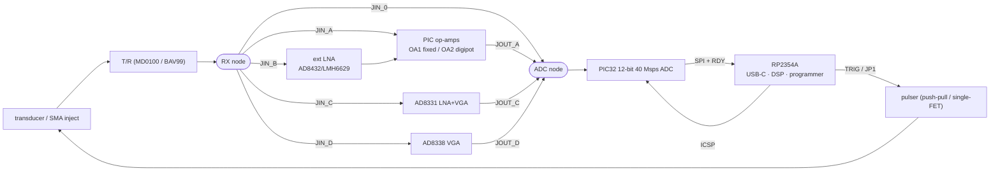

# minus DesignA-DK — PCB design brief

**Single-channel pulse-echo ultrasound development / derisking board.**
Contact: kelu124 (Luc J). Prior art: [kelu124/pic32arick](https://github.com/kelu124/pic32arick).
Fuller rationale + test plan: [`README.md`](README.md) in this folder.

> This is an **evaluation board** — the goal is **flexibility and measurability, not size
> or cost**. Everything is on **one board**; contested design choices are selected with
> **jumpers**, and every analog node has a **test point / SMA tap**. Once the bench picks
> winners, a cheap product board ([DesignA](../designA/README.md)) is this board with the
> losing options depopulated.

---

## 0. Must-fix issues before layout (read first)

From a design review ([`review-findings.md`](review-findings.md), 2026-09-21). Full list
there; the load-bearing ones for the PCB designer:

- **USB-C: add 5.1 kΩ `Rd` pull-downs on CC1 and CC2** (else VBUS never enables). Verify
  RP2354 USB **DP/DM 27 Ω** series terminations. *(B4)*
- **ICSP MCLR: use LVP-only, or isolate the RP2354's MCLR tap** (series R + clamp / lift
  jumper). A PICkit HV-Vpp (~9 V) on the shared net would exceed the RP2354's 3.3 V
  abs-max. Add series R on the RP2354 PGC/PGD/MCLR taps too. *(B5/C13)*
- **HV-rail select is MD1213-path only** — never feed boost/external HV into the IRLML
  5 V totem (a 5 V driver can't turn the P-FET off → shoot-through). Interlock it. *(B7)*
- **Pulser dead-time:** the TC4427A has **none** — drive the totem **tied-gate (one
  signal)** or insert dead-time in the PWM; add a **10 kΩ pull-down** on the driver
  input (default OFF). *(A5/C1/C3)*
- **Anti-alias corner ~6–8 MHz**, not the ~28 MHz drawn (no alias rejection at 40/20
  Msps). *(B3)*
- **Gain-stage bandwidth:** one op-amp can't give the full +56 dB at 3–4 MHz (GBW limit
  ≈ +34 dB usable) — distribute gain / plan on the LNA path. *(B1/B2)*
- **RX/ADC nodes:** prefer **0 Ω links over pin headers**, tie unused FE inputs to
  mid-rail, and give **each FE path its own AC-couple + bias** (one shared bias buffer
  can't serve FE-0/FE-A/VGAs). *(C8/C9)*
- **Single I²C master** (RP2354) for the gain/OLED bus. *(C12)*

---

## 1. Overview

A single-channel ultrasound front-end pairing two MCUs:

- **RP2354A** (Raspberry Pi, QFN-60, 7×7 mm) — USB-C host link, system manager, DSP,
  RGB LED, and **in-system programmer for the PIC** over ICSP. **2 MB in-package flash →
  no external flash chip.** LCSC/JLCPCB `C41378174`.
- **PIC32AK6416GC41064** (Microchip, 64-pin TQFP or VQFN) — the **analog capture engine**:
  three on-die **100 MHz op-amps** (RX gain), a **12-bit 40 Msps ADC**, and **HS-PWM**
  (drives the pulser *and* the ADC trigger). Single-supply 3.0–3.6 V.
  *Sourcing note:* not currently LCSC-stocked → consign or hand-place. Datasheet
  **DS70005592** and flash-programming spec **DS70005583** are in
  [`../../pdfs/datasheets/`](../../pdfs/datasheets/).

**Signal flow:**
`transducer → T/R → [selectable RX front-end] → PIC32 ADC → SPI → RP2354 → USB-C`, and
`PIC HS-PWM / RP2354 PIO → pulser → transducer`.

## 2. Board-level requirements

- **4-layer**, solid ground plane under the analog section; **size unconstrained** —
  favour clean layout + probe access over compactness.
- **All MCU pins broken out** to labelled 0.1″ headers.
- **KiCad** deliverable (schematic, PCB, gerbers, BOM CSV). Fine-pitch parts (RP2354A,
  PIC32AK) placed for **JLCPCB assembly**; headers/jumpers/SMA hand-solderable.
- **Self-documenting silkscreen:** label every block, header pin, jumper, and test point.

## 3. Power & clocks

| Rail | Source | Notes |
|------|--------|-------|
| **+5 V** | USB-C VBUS | logic 5 V; also the **pulser rail** but **ferrite-isolated** (~600 Ω @100 MHz) with local bulk (100 µF) + HF (100 nF/10 nF) decoupling at the FETs |
| **+3V3 DVDD** | 3V3 LDO from 5 V | digital: RP2354, PIC digital, LED, logic |
| **+3V3 AVDD** | from 3V3 via ferrite/0 Ω + **current-sense pads** | analog: PIC AVDD, op-amps/ADC — keep quiet |
| **VREF** | **AVDD** (no external VREF pin on this family) | ADC full-scale; decouple per datasheet |

- **RP2354 `QSPI_IOVDD` must be 3.3 V** (internal flash). Provide the PIC **`VCAP`** cap.
- **RP2354 USB clock:** 12 MHz crystal + load caps hugging the device (guard ring). **PIC**
  uses its internal FRC+PLL (no crystal). **100 nF per supply pin**, close.

## 4. Programming / debug (two paths, shared net)

- **RP2354:** USB-C **BOOTSEL** button = **`QSPI_CSn`(SS) → GND via ~1 kΩ**, pressed at
  power-up; plus a **RUN** reset button. Flashed by UF2 drag-and-drop.
- **PIC32:** **6-pin ICSP** header — `1 MCLR/Vpp · 2 VDD · 3 GND · 4 PGED1 · 5 PGEC1 ·
  6 NC` — **plus Tag-Connect TC2030-NL pads** (consider the **off-center / alternated
  friction-fit holes** for a solderless press-fit). **47 Ω series** on PGEC1/PGED1; **10 kΩ**
  MCLR pull-up, short MCLR net, **no cap loading Vpp**.
- The **RP2354 also connects to `PGC/PGD/MCLR`** so it can bit-bang LVP ICSP (one USB-C
  port programs both). **Only one programmer at a time** — keep RP2354's ICSP pins Hi-Z
  when a PICkit drives the header (series R + firmware).

## 5. Inter-MCU interface (RP2354 ↔ PIC32)

| Bus | Signals | Purpose |
|-----|---------|---------|
| **SPI** | SCK, MOSI, MISO, CS | RP2354 (master) reads the captured A-line from the PIC, ≤ 40 Mbps |
| **IRQ** | RDY | PIC → RP2354 "line ready" |
| **Trigger** | TRIG | RP2354 → PIC ADC external trigger (used when RP2354 owns TX) |
| **I²C** | SDA, SCL | gain-control digipot/DAC + OLED |
| **UART** | TX, RX | debug/log (optional) |

## 6. Transmit / pulser (bench with populate-options)

- **Push-pull default:** **IRLML6244 (N)** + **IRLML2244 (P)** driven by a **TC4427A**
  dual gate driver (**8-pin**, 3V3→5V level-shift; **no internal dead-time** — insert it in
  the PWM or drive the totem tied-gate). **Footprint for a single low-side
  N-FET (2N7002)** as the minimal alternative.
- **Gate-drive source = JP1** (3-pin): **PIC32 HS-PWM** ⟷ **RP2354 PIO**; the TC4427A sits
  **after** JP1; only one source at a time (the other Hi-Z).
- **HV-rail select jumper:** USB **5 V** / on-board **boost** (footprint) / **external HV**
  header. Also **pads for an MD1213 + TC6320** high-voltage pulser for later.
- **Damping:** selectable series/parallel resistor (100–200 Ω) at the transducer node.
- **T/R protection:** **MD0100** (footprint) with a **BAV99** clamp alternative.
- **TX↔ADC coupling:** the PIC HS-PWM that drives the gate can also emit the ADC-start
  trigger off the **same counter** (phase-locked, ~2.5 ns, zero-jitter) — route so this is
  exercisable and expose the trigger on a test point.

## 7. Receive front-end (jumper-selected, all on-board)

A common **RX node** (after the T/R) and a common **ADC node** (to a PIC ADC input). Each
block taps RX via `JIN_*` and drives the ADC node via `JOUT_*`. **Fit one JIN+JOUT pair to
select a path;** unused blocks are left un-jumpered (isolated → no loading). **Place the
JIN links right at the RX node to minimise stubs on the RF path.**

| Path | Blocks to place | Route |
|------|-----------------|-------|
| **FE-0 straight** | (link only) | RX → ADC (no gain — baseline noise ref) |
| **FE-A PIC-opamp** | route PIC OA1/OA2/OA3 in+out pins to the board | RX → OA1 fixed → OA2 (digipot) → ADC |
| **FE-B LNA + PIC-opamp** | **AD8432 / LMH6629 / OPA847** | RX → LNA → PIC OA → ADC |
| **FE-C ext VGA** | **AD8331** (QSOP-20) | RX → AD8331 → ADC |
| **FE-D ext VGA (low-power)** | **AD8338** (LFCSP-16, 3×3) | RX → AD8338 → ADC |

**Gain-control options** (jumper-selected into the OA2 gain node or the VGA `Vgain` pin):
**MCP4531** digipot (I²C) · **MCP4131** digipot (SPI) · **74HC4052** resistor-mux ·
**MCP4728** DAC or RP2354 **PWM+RC** for `Vgain`.

**ADC input conditioning — critical (single supply).** The ADC sees only **0 → VREF
(≈ 3.3 V)**; the 0-centred RF (≈ ±2 V raw) must be:
1. **AC-coupled** into the gain stage (HPF corner < ~100 kHz so 3–4 MHz passes flat);
2. **biased to mid-rail VREF/2 ≈ 1.65 V** — provide the **mid-rail bias buffer** (PIC OA3,
   or a divider + buffer);
3. **scaled so the largest echo of interest ≈ 2.6–2.8 Vpp** (±1.3–1.5 V, ~0.2–0.3 V rail
   headroom) — never bipolar, never full ±2 V into the ADC;
4. protected by an **overrange clamp** (diodes to the rails) at the ADC input.
Anti-alias filter before the ADC: **2-pole RC ≈ (100 Ω + 56 pF) × 2**. Prefer
**single-ended** ADC input (this ADC's differential range is limited).

## 8. Transducer & connectors / instrumentation

- **Transducer:** **SMA/coax + 2×1 2.54 mm header + u.FL** footprints (populate as needed).
- **SMA/coax taps** at: transducer node, LNA out, VGA/op-amp out, **ADC input**, TX gate —
  for signal-generator injection / scope probing. High-Z nodes: AC-couple / series-R the
  tap so it does not load the path (mark any tap intended as a matched 50 Ω injection).
- **Loopback self-test:** a mux/jumper to switch the RX input between the transducer and an
  injected reference (PIC DAC / SMA) to characterise the chain electrically (no acoustics).
- **Test points** on: all rails, VREF, clocks, SPI/I²C, RDY, TRIG, MCLR/PGC/PGD, HV rail,
  mid-rail bias node.
- Optional: **RPi 40-pin** header (may be unpopulated pads), **SAO** header, **I²C OLED
  (SSD1306)**, **WS2812** RGB LED.

## 9. Layout guidance (mixed-signal + HV pulse + 40 Msps ADC)

- **Ground:** one solid GND plane; keep the **RX analog return** clean and under the RX
  chain. Do **not** route SPI / PWM / USB / digital across the RX front-end.
- **AVDD/DVDD** split, joined at a single point (ferrite / 0 Ω) with the current-sense pads.
- **Pulser:** keep the TX switching loop (FETs ↔ decoupling ↔ transducer return) **tight
  and away from RX**; the T/R node is the analog boundary. Decoupling right at the FET/driver.
- **RX:** short op-amp feedback loops; **guard the high-impedance op-amp inputs**; minimise
  stubs on the shared RX and ADC nets; VREF + ADC-input decoupling per the datasheet.
- **Clock:** crystal + caps hugging the RP2354, guard ring.

## 10. Deliverables

KiCad project (schematic + PCB), schematic **PDF**, **gerbers + drills**, and a **costed
BOM CSV** with LCSC/Digikey part numbers. Mark the **populate-optional** parts in the BOM:
the FE variants (A–D), the gain-control options, the single-FET pulser, the MD1213/boost
pads, OLED, and the 40-pin header.

## 11. Reference material

- PIC32AK **datasheet DS70005592**, **flash-prog-spec DS70005583**, product brief
  DS70005582 — [`../../pdfs/datasheets/`](../../pdfs/datasheets/) (each with a `.md` sibling).
- Prior art (pulser / op-amp chain / ICSP header): **[kelu124/pic32arick](https://github.com/kelu124/pic32arick)**.
- Solderless friction-fit ICSP header: **[microchip pic32ak1216gc41064-gpdim-demo](https://github.com/microchip-pic-avr-examples/pic32ak1216gc41064-gpdim-demo)**.
- Gain / LNA IC options + LCSC prices: [`../../systems/afe-vga-ics.md`](../../systems/afe-vga-ics.md).
- Target low-cost product this board feeds: [`../designA/README.md`](../designA/README.md).
